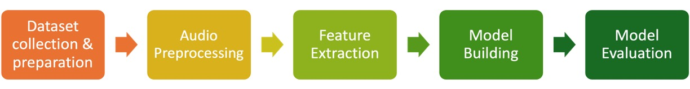
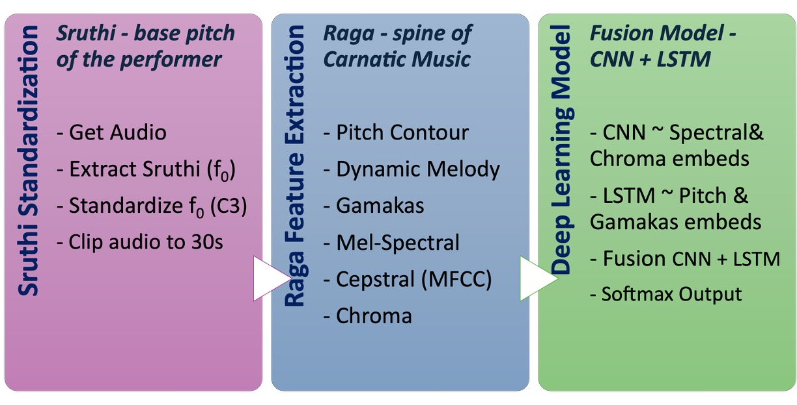
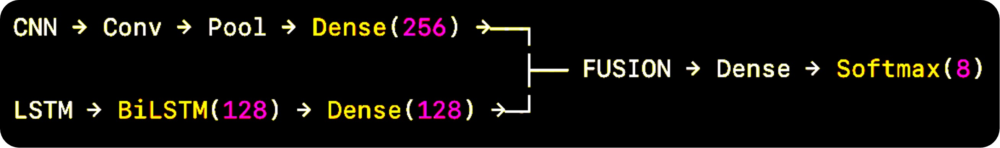

# Carnatic Music Raga Identification using MIR + Deep Learning

This is an ongoing project and repository is subject to constant updates.<br>

**Project Motivation & Description**<br>
Carnatic music is one of the oldest and most historic music systems in the world. Raga is the single most crucial melodic framework of this music art form that provides the rules and notes for a Carnatic composition.Learning to identify a song’s raga is a core competency developed during an Indian Carnatic music education. Therefore, Raga recognition is an important step in computational musicology & MIR as far as Indian Carnatic music is considered. <br> <br> This Project aims to leverage MIR techniques to extract and analyze Carnatic audio for 8 melakartha ragas, followed by building a fusion deep learning model (CNN+LSTM) for Raga classification.

## Dataset:
The audio dataset is currently not included in this repository due to heavy file size.<br> 
Link to dataset:  <br>
[Indian Art Music Raga Recognition datasets](https://compmusic.upf.edu/datasets) [1]<br>

Link to the sample dataset: <br>
[Sample dataset](https://drive.google.com/drive/folders/14oVxOAg2Mu-I-rml4iA3Bmp-ABV8P8Nu?usp=share_link)<br>

The Sample dataset consisits 8 Melakarta Ragas, namely hanumathodi, harikaambhoji, kaamavardhini, kalyani, kharaharapriya, maayamaalavagowlai, shankaraabharanam & shanmugapriya. Minimum of 5 songs from each of these 8 ragas are selected based on their audio size and curated in the sample dataset.


## Methodology:<br>
Below methoddology has been followed in this project.<br>

<br>

There are 3 major pipelines in this project:<br>

<br>

For this project, I used both Google Collab & Microsoft Visual Studio for coding. Feature extraction was performed in Visual Studio code while EDA & Model Building was performed in Collab. My observation and recommendation is to build the entire project in Collab to leverage the free student compute and other resources it provides for one year. However, this can be built in local IDEs for small datasets for ease of usage and experimentations.<br>


## Details on files & folders<br>
**This code repository is organised into following key components:**<br>
- README.md: The current file you are reading giving an overview of the project.<br>
- requirements.txt: Contains all the necessary libraries that should be installed in the virtual environment of Microsoft Visual Studio code. <br>
- helpers.py: Contains all the custom helper functions for the two pipelines Sruthi Identification/ Standardization and Raga Features Extraction. <br>  
- pipelines.py: Contains the two Custom pipelines mentioned above, organizing all the relevant helper functions in a sequential order within them. <br>  
- feature_extraction_code.ipynb: This is code file that activates the 2 pipelines and generates the pickle file containing the features. <br>
- [raga_features_merged_df.pkl:](https://drive.google.com/file/d/1Af-9TPFVyLkXVV13bI5zVM3eQXhqURZB/view?usp=share_link) This dataset contains the essential features of Ragas extracted using the pieplines. By default, there is a folder called temp created and this pickle file gets created within it. !!! This is going to be a huge file!!! 
- eda_code.ipynb: This includes the codes used for the Exploratory Data Analysis and visualizations of Raga Features.
- model_building.ipynb: This includes the codes used for building the fusion model, model training/ evaluation  and embedding space visualizations.<br>
    <br>
- Reports: This section will be updated post completion of this project

## How to use this repository? <br>

In the following section, I have given the details as per the way I have organized and experimented with my codes. <br>
Feature extraction was performed in Visual Studio code while EDA & Model Building was performed in Collab.
Follow the steps below, to experiment with my code:<br>
- Fork the repository <br>
- Clone your forked repo to your local <br>
```bash
git clone https://github.com/sundarram1608/carnatic_music_raga_identification_mir.git
```
- Download the [Sample dataset](https://drive.google.com/drive/folders/14oVxOAg2Mu-I-rml4iA3Bmp-ABV8P8Nu?usp=sharing) provided, to the same folder as the other code files of this repo.
- Folder hierarchy as mentioned above is important for codes to execute seamlessly.
- Open terminal and follow the below CLI prompts one by one to create a virtual environment<br>
```bash
cd “path to directory“
```
```bash
python3 -m venv myenv
```
```bash
source myenv/bin/activate
``` 
```bash
pip install -r requirements.txt
```
- This creates the virtual environment necessary to run the sruthi identification/ standardization & raga feature extraction pipeline in Visual Studio code.
- If there are compute issues, you could upload the cloned repository to your Google Drive and open the ipynb file with Collab.
- In collab, select the GPU compute resource (for e.g. L4) and then mount your drive. From then, you are free to run and experiment with the code.
- All the .py and .ipynb files have guided comments and are self explanatory.

## Credits:
I thank my mentor Dr. Xiao Hu and all the references and citations I have mentioned below, to enable me with the structured thought process to approach this problem.
The codes in this repository, sample datasets and structuring solely belongs to the author and mentor. Links to any external references are available as an when leveraged.

## References:<br>
[1] Serrà, J., Ganguli, K. K., Sentürk, S., Serra, X., & Gulati, S. (2016). Indian Art Music Raga Recognition Dataset (audio) (1.0) [Data set]. Zenodo. https://doi.org/10.5281/zenodo.7278511<br><br>
[2] Sridhar, Rajeswari & Geetha, T.V. (2009). Raga Identification of Carnatic music for music Information Retrieval. SHORT PAPER International Journal of Recent Trends in Engineering. 1. [Research Gate](https://www.researchgate.net/publication/228960849_Raga_Identification_of_Carnatic_music_for_music_Information_Retrieval)<br><br>
[3] Shah, Devansh & Jagtap, Nikhil & Talekar, Prathmesh & Gawande, Kiran. (2021). Raga Recognition in Indian Classical Music Using Deep Learning. 10.1007/978-3-030-72914-1_17. [Research Gate](https://www.researchgate.net/publication/350553712_Raga_Recognition_in_Indian_Classical_Music_Using_Deep_Learning)<br><br>
[4] Ravikoti, Sridhar. (2020, September). Identifying Ragas in Carnatic Music with Machine Learning [LinkedIn](https://www.linkedin.com/pulse/identifying-ragas-carnatic-music-machine-learning-sridhar-ravikoti/)<br><br>
[5] Great Learning Snippets. (2020, July). Deep Learning Based Raga Classification in Carnatic Music [Medium](https://medium.com/@blogsupport/deep-learning-based-raga-classification-in-carnatic-music-e499018ea1b7)<br><br>
[6] Srinivasan, Shriya. (2021, August). Carnatic Raga Recognition [Medium](https://medium.com/@shriya_32059/carnatic-raga-recognition-28ba52ec9563)<br><br>
[7] Divan, Shreyas. (2021, November). Raga identification using ML and DL [Medium](https://medium.com/@shreyas.divan/raga-identification-using-ml-and-dl-a95b51f47044)

